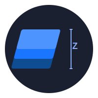
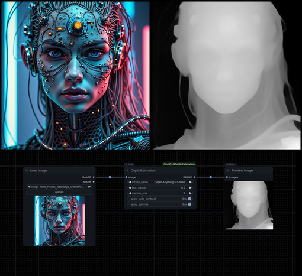

##  ComfyUI Depth Estimation Node

<div align="center">
  
</div>

A robust custom depth estimation node for ComfyUI using Depth-Anything models to generate depth maps from images.

## Features
- Multiple model options:
  - Depth-Anything-Small
  - Depth-Anything-Base
  - Depth-Anything-Large
  - Depth-Anything-V2-Small
  - Depth-Anything-V2-Base
  - Depth-Anything-V3-Small (Requires optional dependency)
  - Depth-Anything-V3-Base (Requires optional dependency)
- Post-processing options:
  - Gaussian blur (adjustable radius)
  - Median filtering (configurable size)
  - Automatic contrast enhancement
  - Gamma correction
- Advanced options:
  - Force CPU processing for compatibility
  - Force model reload for troubleshooting

## Installation

### Method 1: Install via ComfyUI Manager (Recommended)
1. Open ComfyUI and install the ComfyUI Manager if you haven't already
2. Go to the Manager tab
3. Search for "Depth Estimation" and install the node

### Method 2: Manual Installation
1. Navigate to your ComfyUI custom nodes directory:
   ```bash
   cd ComfyUI/custom_nodes/
   ```

2. Clone the repository:
   ```bash
   git clone https://github.com/Limbicnation/ComfyUIDepthEstimation.git
   ```

3. Install the required dependencies:
   ```bash
   cd ComfyUIDepthEstimation
   pip install -r requirements.txt
   ```

4. (Optional) To enable Depth Anything V3 models:
   ```bash
   pip install git+https://github.com/ByteDance-Seed/Depth-Anything-3.git
   ```

4. Restart ComfyUI to load the new custom node.

> **Note**: On first use, the node will download the selected model from Hugging Face. This may take some time depending on your internet connection.

## Usage

<div align="center">
  
</div>
<div align="center">
  
</div>

### Example Results (Depth Anything V3)
<div align="center">
  
  
</div>

### Node Parameters

#### Required Parameters
- **image**: Input image (IMAGE type)
- **model_name**: Select from available Depth-Anything models
- **blur_radius**: Gaussian blur radius (0.0 - 10.0, default: 2.0)
- **median_size**: Median filter size (3, 5, 7, 9, 11)
- **apply_auto_contrast**: Enable automatic contrast enhancement
- **apply_gamma**: Enable gamma correction

#### Optional Parameters
- **force_reload**: Force the model to reload (useful for troubleshooting)
- **force_cpu**: Use CPU for processing instead of GPU (slower but more compatible)

### Video Processing
The node supports video processing via batch inputs. You can load a video using standard ComfyUI video loaders (e.g., "Load Video") or "Load Images from Folder", which pass frames as a batch. The node processes the entire batch efficiently.

### Example Usage
1. Add the `Depth Estimation` node to your ComfyUI workflow
   - *Tip: You can find example workflows in the `workflows/` directory.*
2. Connect an image source to the node's image input
3. Configure the parameters:
   - Select a model (e.g., "Depth-Anything-V2-Small" is fastest)
   - Adjust blur_radius (0-10) for depth map smoothing
   - Choose median_size (3-11) for noise reduction
   - Toggle auto_contrast and gamma correction as needed
4. Connect the output to a Preview Image node or other image processing nodes

## Model Information

| Model Name | Quality | VRAM Usage | Speed |
|------------|---------|------------|-------|
| Depth-Anything-V2-Small | Good | ~1.5 GB | Fast |
| Depth-Anything-Small | Good | ~1.5 GB | Fast |
| Depth-Anything-V2-Base | Better | ~2.5 GB | Medium |
| Depth-Anything-Base | Better | ~2.5 GB | Medium |
| Depth-Anything-V3-Small | Excellent | ~2.0 GB | Fast |
| Depth-Anything-V3-Base | Superior | ~2.5 GB | Medium |
| Depth-Anything-Large | Best | ~4.0 GB | Slow |

## Troubleshooting Guide

### Common Issues and Solutions

#### Model Download Issues
- **Error**: "Failed to load model" or "Model not found"
- **Solution**: 
  1. Check your internet connection
  2. Try authenticating with Hugging Face:
     ```bash
     pip install huggingface_hub
     huggingface-cli login
     ```
  3. Try a different model (e.g., switch to Depth-Anything-V2-Small)
  4. Check the ComfyUI console for detailed error messages

#### CUDA Out of Memory Errors
- **Error**: "CUDA out of memory" or node shows red error image
- **Solution**:
  1. Try a smaller model (Depth-Anything-V2-Small uses the least memory)
  2. Enable the `force_cpu` option (slower but uses less VRAM)
  3. Reduce the size of your input image
  4. Close other VRAM-intensive applications

#### Node Not Appearing in ComfyUI
- **Solution**:
  1. Check your ComfyUI console for error messages
  2. Verify that all dependencies are installed:
     ```bash
     pip install transformers>=4.20.0 Pillow>=9.1.0 numpy>=1.23.0 timm>=0.6.12
     ```
  3. Try restarting ComfyUI
  4. Check that the node files are in the correct directory

#### Node Returns Original Image or Black Image
- **Solution**:
  1. Try enabling the `force_reload` option
  2. Check the ComfyUI console for error messages
  3. Try using a different model
  4. Make sure your input image is valid (not corrupted or empty)
  5. Try restarting ComfyUI

#### Slow Performance
- **Solution**:
  1. Use a smaller model (Depth-Anything-V2-Small is fastest)
  2. Reduce input image size
  3. If using CPU mode, consider using GPU if available
  4. Close other applications that might be using GPU resources

### Where to Get Help
- Create an issue on the [GitHub repository](https://github.com/Limbicnation/ComfyUIDepthEstimation/issues)
- Check the ComfyUI console for detailed error messages
- Visit the ComfyUI Discord for community support

## License

This project is licensed under the Apache License.

---